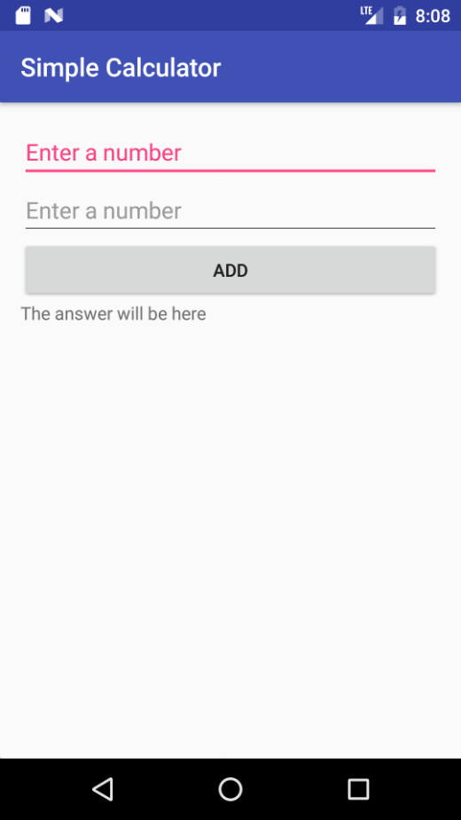

# Simple Calculator

## What is this?

This repository is starter code for a simple calculator app for Android.  It can be used to learn some of the basics of coding using the Android framework.  It has one Activity and one layout.

If you are not familiar with using git please see the first git lab.

Note: The [gitignore](.gitignore) file covers Windows, OS X, Android Studio and Eclipse.

## Instructions for using it:

1. Fork the repository, there should be a fork button on the upper right hand side of this page.
2. Clone your fork onto your computer
3. Open it as an existing project in android studio or other IDE.
4. Run it on an AVD or a real device.
5. At this point you will see:

6.  Now that you are sure it works, make the requested changes.

Changes
  1. validate input if empty or not numeric display an appropriate message in the result field.
  2. add buttons to the UI for subtract, divide, multiply and their associated code
  3. validate input for division, no divide by zero
  4. add a button that will clear all text fields
  5. the hint for the result widiget is hard coded, move it to the strings.xml file
  6. change the colour of the text
  7. change the colour of the buttons
  8. see if there are any other instructions in the TODOs written in the source code comments.

  Note As you make your changes, be sure to push to gitblargh.
